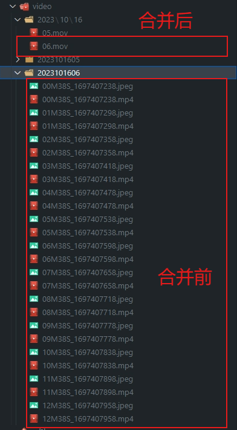

#小米摄像头视频文件合并

> 由于小米摄像头保存的视频传到NAS都是一分钟一个文件，而且NAS上保存的视频不支持在APP回看，所以回看相当的不方便。所以百度查找到一个合并视频文件的方式，根据[大神的开发的windows脚本](./小米摄像头录像合并脚本.bat)开发成golang版本，跨平台使用，支持docker。


## 合并前后对比图

合并完成后是按每小时一个视频储存的`.mov`格式的视频文件



## 开始

### 1. 搭建ffmpeg环境（如果你有docker环境，请直接向下看docker运行）
根据自身系统查找教程即可

### 2. 编译和运行

#### 编译（保证已经搭建完成go环境）

```
# linux
go run -o xiaomi_camera_merge main.go

# windows
go run -o xiaomi_camera_merge.exe main.go
```


#### 运行

参数说明：

- -delete 合并完成后删除源文件夹及视频（如果不删除每次运行都会把目录所有的视频再合并一次）
- -path string  视频的保存目录 (default "./")


执行示例：
```
# linux 
./xiaomi_camera_merge -delete -path /mnt/xiaomi/video

# windows
.\xiaomi_camera_merge.exe -delete -path D:\xiaomi_video

```

## 3. docker运行（推荐）


运行参数说明
- `/mnt/xiaomi/camera` 换成你摄像机储存视频的目录即可
- `-e "DELETE_SUCCESS=true"` [可选]合并完成后删除源文件夹及视频（如果不删除每次运行都会把目录所有的视频再合并一次）

方式1.使用构建好的镜像：
```
# 拉取镜像
docker pull hslr/xiaomi-camera-merge:v1
# 运行
docker run --rm -it -v /mnt/xiaomi/camera:/app/video -e "DELETE_SUCCESS=true" hslr/xiaomi-camera-merge:v1
```

方式2.自构建镜像:
```
# 1.拉取本仓库代码后，进入项目跟目录运行下方代码
docker build -t mi_camera_merge:latest .

# 2.运行容器
docker run --rm -it -v /mnt/xiaomi/camera:/app/video -e "DELETE_SUCCESS=true" mi_camera_merge
```

